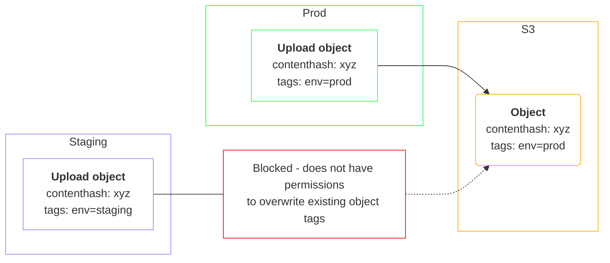

# Tagging
Tagging allows extra metadata about your files to be send to the external object store. These sources are defined in code, and currently cannot be configured on/off from the UI.

Currently, this is only implemented for the S3 file system client. 
**Tagging vs metadata**

Note object tags are different from object metadata.

Object metadata is immutable, and attached to the object on upload. With metadata, if you wish to update it (for example during a migration, or the sources changed), you have to copy the object with the new metadata, and delete the old object. This is problematic, since deletion is optional in objectfs.

Object tags are more suitable, since their permissions can be managed separately (e.g. a client can be allowed to modify tags, but not delete objects).

## File system setup
### S3
[See the S3 docs for more information about tagging](https://docs.aws.amazon.com/AmazonS3/latest/userguide/object-tagging.html).

You must allow `s3:GetObjectTagging` and `s3:PutObjectTagging` permission to the objectfs client.

## Sources
The following sources are implemented currently:
### Environment
What environment the file was uploaded in. Configure the environment using `$CFG->objectfs_environment_name`

### Mimetype
What mimetype the file is stored as under the `mdl_files` table.

## Multiple environments pointing to single bucket
It is possible you are using objectfs with multiple environments (e.g. prod, staging) that both point to the same bucket. Since files are referenced by contenthash, it generally does not matter where they come from, so this isn't a problem. However to ensure the tags remain accurate, you should turn off `overwriteobjecttags` in the plugin settings for every environment except production.

This means that staging is unable to overwrite tags for files uploaded elsewhere, but can set it on files only uploaded only from staging. However, files uploaded from production will always have the correct tags, and will overwrite any existing tags. 

## Migration
If the way a tag was calculated has changed, or new tags are added (or removed) or this feature was turned on for the first time (or turned on after being off), you must do the following: 
- Manually run `trigger_update_object_tags` scheduled task from the UI, which queues a `update_object_tags` adhoc task that will process all objects marked as needing sync (default is true)
or
- Call the CLI to execute a `update_object_tags` adhoc task manually.

## Reporting
There is an additional graph added to the object summary report showing the tag value combinations and counts of each.

Note, this is only for files that have been uploaded from this environment, and may not be consistent for environments where `overwriteobjecttags` is disabled (because the site does not know if a file was overwritten in the external store by another client).

## For developers

### Adding a new source
Note the rules about sources:
- Identifier must be < 32 chars long.
- Value must be < 128 chars long.

While external providers allow longer key/values, we intentionally limit it to reserve space for future use. These limits may change in the future as the feature matures.

To add a new source:
- Implement `tag_source`
- Add to the `tag_manager` class
- As part of an upgrade step, mark all objects `tagsyncstatus` to needing sync (using `tag_manager` class, or manually in the DB)
- As part of an upgrade step, queue a `update_object_tags` adhoc task to process the tag migration.